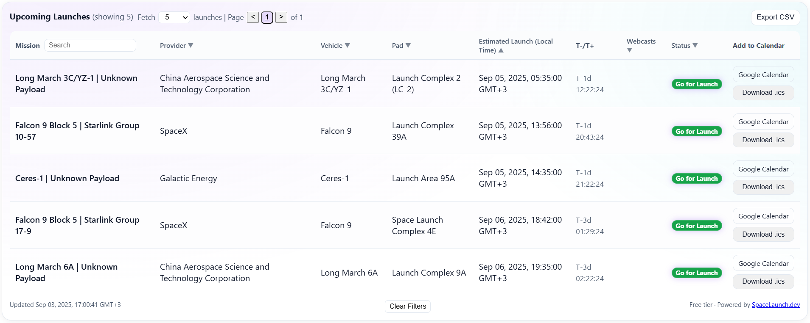

# Space Launch Widget (beta)

Lightweight, copy-paste widget + API for upcoming rocket launches.

- **30-second embed** (no build, no deps)
- Filters & search via UI / query params
- CSV export / Calendar imports
- REST API

[**Check out our demo site**](https://spacelaunch.dev/?utm_source=github&utm_medium=repo&utm_campaign=spacelaunch_widget)

[](#license)


---



---

## Quick start (HTML - simplest)

Create an HTML file and paste:

```html
<!DOCTYPE html>
<html lang="en">
<head>
    <meta charset="utf-8" />
    <meta name="viewport" content="width=device-width,initial-scale=1" />
    <title>Space Launch Widget Demo</title>
</head>
<body>
    <div class="space-launch-widget" data-source="https://spacelaunch.dev/api/launches" data-limit="5">
    </div>
    <!-- Script: loads the widget and renders inside .space-launch-widget -->
    <script src="https://spacelaunch.dev/embedable.js"></script>
</body>
</html>
```

Open the file - done.

### Options (as `data-*` or URL query params)

You can pass options as attributes **or** on the script URL:

```html
<script src="https://spacelaunch.dev/embedable.js?limit=5&provider=SpaceX"></script>
```

Common options:

| Option      | Values / examples               | Default | Notes                                      |
|-------------|----------------------------------|---------|--------------------------------------------|
| `limit`     | `5`, `10`                        | `5`     | Number of upcoming launches                |
| `provider`  | `SpaceX`, `RocketLab`, `ULA`…    | (all)   | Case-insensitive; comma-separated allowed  |
| `search`    | free text                        |         | Matches mission/rocket/site                |


---

## WordPress

Add this to your theme’s `functions.php` or a tiny plugin:

```php
<?php
function spacelaunch_enqueue_script() {
  // Register & enqueue once site-wide or conditionally
  wp_register_script(
    'spacelaunch-widget',
    'https://spacelaunch.dev/embedable.js',
    [],
    null,
    true
  );
  wp_enqueue_script('spacelaunch-widget');
}
add_action('wp_enqueue_scripts', 'spacelaunch_enqueue_script');

function spacelaunch_widget_shortcode($atts = []) {
  $a = shortcode_atts([
    'limit'    => '5',
    'provider' => '',
  ], $atts);

  $attrs = sprintf(
    'data-limit="%s"%s',
    esc_attr($a['limit']),
    $a['provider'] !== '' ? ' data-provider="'.esc_attr($a['provider']).'"' : ''
  );

  // Only the container; script handled by enqueue
  return '<div class="space-launch-widget" '.$attrs.'></div>';
}
add_shortcode('spacelaunch', 'spacelaunch_widget_shortcode');
```

Use in a post/page:

```
[spacelaunch limit="5" provider="SpaceX"]
```

---

## React

```jsx
// ReactWidget.jsx
import { useEffect } from "react";

export default function SpaceLaunchWidget({
  limit = 5,
  provider = ""
}) {
  useEffect(() => {
    const src = "https://spacelaunch.dev/embedable.js";
    if (!document.querySelector(`script[src="${src}"]`)) {
      const s = document.createElement("script");
      s.src = src;
      s.async = true;
      document.body.appendChild(s);
    }
  }, []);

  return (
    <div
      className="space-launch-widget"
      data-limit={limit}
      data-provider={provider}      
    />
  );
}
```

Usage:

```jsx
import SpaceLaunchWidget from "./ReactWidget";

export default function Page() {
  return <SpaceLaunchWidget limit={5} provider="SpaceX" />;
}
```

> **Next.js note:** Render this on the client (e.g., inside a client component or with `dynamic(() => import('./ReactWidget'), { ssr: false })`).

---

## Styling / theming

- The widget ships with its own minimal styles.  
- For custom look-and-feel, open an issue in this repo with a request (theme variables, CSS custom properties, etc.).

---

## Paid tier coming soon!

> **Early signups will get paid tier capabilities for free for 3 months! Including:**  
- Export to CSV
- Add to Google Calendar / Download .ics buttons
- Extended limits
- Custom theming 


Join [here](https://spacelaunch.dev/?utm_source=github&utm_medium=repo&utm_campaign=spacelaunch_widget)<br>
Or contact us by email at [info@spacelaunch.dev](mailto:info@spacelaunch.dev)

---

## API
### Making Requests
- Fire GET requests to https://spacelaunch.dev/api/launches with the parameters described in the docs.
- Sample request:<br> 
```bash curl --request GET 'https://spacelaunch.dev/api/launches?provider=Blue%20Origin&rocket=New%20Shepard&status=To%20Be%20Determined&description=new&has_webcasts=true&limit=10&is_test=false' ```

### DOCS
- Swagger UI: https://spacelaunch.dev/api/docs
- ReDoc: https://spacelaunch.dev/api/redoc
- OpenAPI JSON: https://spacelaunch.dev/api/openapi.json

---

## Support

- Issues & feature requests: GitHub Issues
- Custom integrations or questions: open an issue with details (site/CMS, desired filters/theme)
- For any issues/ideas/feedback feel free to contact us by email at [info@spacelaunch.dev](mailto:info@spacelaunch.dev)

---

## License

MIT © 2025 **SpaceLaunch.dev**  
This license applies **only** to the example code in this repository (HTML/React/WordPress snippets).  
Your use of the live widget and API at `spacelaunch.dev` is governed by their respective terms.
